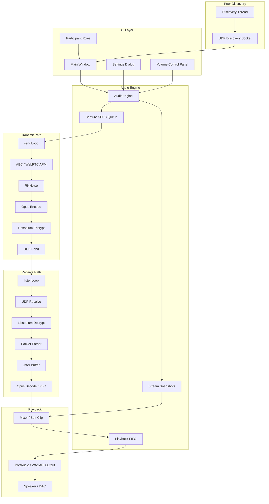

# Nuummite

Nuummite is a decentralized, low-latency peer-to-peer voice communication platform built for real-time LAN operation without a central media server. The codebase is designed around full-mesh routing, tight audio timing, and carefully isolated threads so that user-interface work, network discovery, encryption, and audio processing can all run without blocking the real-time media path.

The project combines a C++ audio engine with a Qt6 Windows client and integrates PortAudio, Opus, Libsodium, RNNoise, and WebRTC Audio Processing Module components to provide a secure, responsive, and technically disciplined voice stack.

## Architectural Foundation

Nuummite separates the system into cooperating modules that exchange data through narrow interfaces:

- **Graphical User Interface**: connection setup, device selection, room state, participant display, and runtime controls
- **Peer Discovery Protocol**: background LAN discovery using UDP broadcasts and local registry maintenance
- **Core Audio Orchestration Engine**: capture, preprocess, encode, encrypt, mix, decode, and render audio
- **Advanced Acoustic Preprocessor**: echo cancellation, automatic gain control, and noise suppression
- **Cryptographic Layer**: 256-bit room key derivation and authenticated packet encryption
- **Codec and Jitter Control**: Opus encode/decode and adaptive buffering for packet reordering and loss concealment

The runtime is intentionally decoupled so that GUI activity does not block the high-priority audio callback or the network receiver loop.

## High-Level Flow



## Dynamic System Initialization

At startup, `main.cpp` initializes the networking and audio foundations before the UI enters its interactive state.

1. Winsock v2.2 is started through `WSAStartup`
2. COM is configured with `CoInitializeEx(nullptr, COINIT_MULTITHREADED)` for multi-threaded WASAPI and system API use
3. A room setup dialog collects the client nickname, room identifier, and passphrase
4. The passphrase is converted into a symmetric room key
5. The audio engine allocates the UDP receiver socket and applies hardened socket options
6. The media listen thread and discovery thread are spawned

### Security and Transport Initialization

Nuummite resolves runtime dependencies dynamically with guarded DLL loading and symbol lookup. Libsodium is used for room key derivation and packet encryption, while PortAudio provides access to the hardware output path.

The security pipeline follows this pattern:

- Load `libsodium.dll` or `libsodium-26.dll`
- Resolve `sodium_init`, `crypto_secretbox_easy`, `crypto_secretbox_open_easy`, and `randombytes_buf`
- Derive a 256-bit key from the user passphrase
- Encrypt every voice payload before transmission

If Argon2id is available, the key derivation path uses `crypto_pwhash`. If not, the system falls back to `crypto_generichash` as a BLAKE2b-based stretching path.

## Peer Discovery Protocol

Nuummite discovers peers on the local network without a central coordinator. The discovery subsystem runs in a background thread on UDP port `50000` and performs two jobs:

- broadcast local presence every `1000 ms`
- collect and prune peer advertisements from the LAN

Discovery packets use the format:

```text
VOICE_PEER:<client_id>:<room_name>:<audio_port>
```

### Discovery Behavior

- Uses UDP broadcast and loopback broadcast for local testing
- Polls the socket with a `250 ms` timeout
- Filters peers by room name
- Marks loopback or local-interface peers as local so multiple instances can run on one machine
- Removes stale peers after `3500 ms` of inactivity

### UI Synchronization

To avoid blocking the GUI thread, the peer registry is mirrored through atomic snapshots. The UI reads the latest snapshot using lock-free atomic load operations, which keeps participant list refreshes responsive even while the discovery thread updates peer state.

## Real-Time Transmit Pipeline

The transmit path captures local microphone input, processes it, encodes it, encrypts it, and sends it to every active peer in the mesh.

### Phase 1: Capture and Downmix

Audio is captured at `48 kHz` with a `20 ms` frame size, which corresponds to `960` samples per frame.

If stereo input is present, the engine downmixes it to mono:

```cpp
int32_t mixed = (static_cast<int32_t>(samples[2 * i]) +
                 static_cast<int32_t>(samples[2 * i + 1])) / 2;
frame[i] = static_cast<int16_t>(std::clamp(mixed, -32768, 32767));
```

The mono frame is written into a lock-free SPSC ring buffer with cache-line aligned indices to reduce false sharing.

### Phase 2: Acoustic Processing

The transmit thread processes captured audio through:

- WebRTC APM for high-pass filtering and echo cancellation
- RNNoise for neural noise suppression
- Automatic gain control if enabled
- Manual gain scaling if AGC is disabled

Manual gain scaling follows:

$$
\text{ScaledSample} = \text{RawSample} \times \left(10^{\frac{\text{tx\_gain\_db}}{20}} \times \frac{\text{mic\_sensitivity}}{50}\right)
$$

### Phase 3: Voice Activity Detection

To reduce unnecessary packet transmission, the engine checks for active speech before encoding. If the built-in VAD is unavailable, the engine falls back to peak-based detection using the microphone sensitivity slider:

$$
\text{VAD\_Threshold} = \text{clamp}(260 - (\text{mic\_sensitivity} \times 2), 60, 220)
$$

If voice is detected, a hangover counter keeps transmission active for `18` frames, or `360 ms`, to avoid choppy cuts between words.

### Phase 4: Opus and Encryption

Active frames are compressed with Opus using VOIP settings, complexity level `10`, and in-band FEC. The payload is then wrapped in a plaintext header and encrypted with Libsodium.

Plaintext payload structure:

```text
client_id|seq|timestamp:<OpusData>
```

Encrypted packet layout:

$$
\text{Packet} = [\text{Nonce (24 bytes)}] + [\text{Authenticated Ciphertext}]
$$

### Phase 5: Network Serialization

The final packet is sent over UDP to all registered peers. To prioritize voice traffic, the socket sets DSCP Expedited Forwarding, which maps to TOS value `0xB8`.

## Real-Time Receive Pipeline

The receive path decrypts, validates, buffers, decodes, mixes, and renders incoming peer audio.

### Phase 1: Packet Reception and Verification

The listen thread waits on the receiver socket with a `100 ms` polling cycle. When a packet arrives, it is decrypted with the room key.

If the packet fails authentication, it is discarded immediately. If it succeeds, the parser extracts:

- sender ID
- sequence number
- timestamp
- Opus payload

### Phase 2: Jitter Buffer and PLC

Each peer stream has its own `JitterBuffer` with a `64`-slot circular store. This absorbs out-of-order packets and short network timing variations.

The buffer adapts over a `50`-packet loss window:

- if loss exceeds `10%`, target buffering rises up to `6` frames
- if loss falls below `2%`, target buffering drops to `2` frames

If a packet is missing during playback, the Opus decoder is invoked with null input to trigger Packet Loss Concealment.

### Phase 3: Stream Mixing

Playback uses a double-buffered stream snapshot so the audio callback can read peer streams without blocking on the main stream map.

The mixer:

- reads the active stream snapshot
- decodes each stream into PCM
- accumulates samples in a high-precision buffer
- scales down the mix if the peak exceeds `28000`
- applies soft clipping before output

Peak-aware scaling:

$$
\text{ScaleFactor} = \frac{28000.0}{\text{Peak}}
$$

Final output scaling:

$$
\text{ScaledPCM} = \text{MixedPCM} \times (\text{master\_volume} \times \text{output\_volume})
$$

The mono signal is duplicated to both output channels when stereo hardware is used.

## Defensive Engineering

Nuummite applies several safety and latency-oriented patterns to keep the real-time path stable.

### Atomic Stream Snapshots

The audio callback does not take a heavy lock while iterating active peers. Instead, it reads from an atomic double-buffered snapshot. This keeps GUI updates and stream creation from interrupting the playback thread.

### CPU-Friendly Spin Waiting

When rebuilding snapshots, the writer waits for readers to drain using `_mm_pause()` on x86/x64 and `std::this_thread::yield()` on other targets. This reduces wasteful contention during critical real-time sections.

### Dual-Driver Capture Fallback

If PortAudio or WASAPI cannot initialize, the engine can fall back to the Windows Multimedia `waveIn` path. That keeps capture functional even on systems where the primary driver route is unavailable.

### UDP Reset Protection

`SIO_UDP_CONNRESET` is disabled so ICMP port-unreachable responses do not break the receiver loop when peers disconnect abruptly.

### Peak-Aware Clipping

The mixer protects against digital clipping by measuring frame peak levels and applying dynamic scaling before soft clipping.

## Technical Specifications

| Domain | Parameter | Value | Purpose |
| --- | --- | --- | --- |
| Audio | Sampling rate | `48000 Hz` | Core processing rate |
| Audio | Frame size | `960 samples` | `20 ms` processing block |
| Audio | Frame bytes | `1920 bytes` | Mono 16-bit PCM block |
| Acoustic preprocessing | RNNoise block size | `480 samples` | `10 ms` neural input block |
| Network | Target UDP port | `50002` | Voice transport |
| Network | Discovery port | `50000` | LAN peer discovery |
| Network | QoS marking | `DSCP 46` / `TOS 184` | Voice priority |
| Jitter control | Buffer size | `64 slots` | Packet reordering window |
| Concurrency | Cache alignment | `alignas(64)` | Avoid false sharing |
| Concurrency | Capture queue | `17 slots` | SPSC capture buffering |

## Performance Calculations

Raw mono PCM bandwidth:

$$
B_{\text{pcm}} = 48000 \times 16 \times 1 = 768000\text{ bps} = 768\text{ kbps}
$$

Opus compression ratio at `48 kbps`:

$$
C_{\text{ratio}} = \frac{768\text{ kbps}}{48\text{ kbps}} = 16 : 1
$$

Packet interval:

$$
\Delta t_{\text{packet}} = \frac{960}{48000} = 0.02\text{ s} = 20\text{ ms}
$$

Approximate Opus payload size per packet:

$$
\text{Size}_{\text{payload}} = 48000 \times 0.02 = 960\text{ bits} = 120\text{ bytes}
$$

Encrypted packet size with nonce and MAC:

$$
\text{Size}_{\text{encrypted}} = 120 + 24 + 16 = 160\text{ bytes}
$$

## Build System

Nuummite uses a modular CMake build and targets Windows x64 development and deployment.

### Toolchain

- Visual Studio 2022 MSVC v143
- CMake 3.20+
- Ninja generator
- Qt 6.5+
- PortAudio, Libsodium, RNNoise, Opus, and WebRTC audio processing dependencies

### Runtime Packaging

The project copies required DLLs and assets beside the executable so the runtime can load everything without global installation.

This includes:

- `opus.dll`
- `libportaudio.dll`
- `libsodium.dll` or `libsodium-26.dll`
- `rnnoise.dll`
- `webrtc-audio-processing-1-3.dll`
- `webrtc-audio-coding-1-3.dll`
- UI assets and icons

## Diagnostic Utilities

Nuummite includes command-line diagnostics for verifying end-to-end audio flow.

These tools help validate:

- capture and playback continuity
- peer discovery correctness
- packet decryption and parsing
- jitter buffer behavior
- loopback and multi-instance testing

Example loopback test:

```dos
.\build-msvc\bin\audio_flow_test.exe --pair --seconds 4 --room test-room --sender-id alpha --receiver-id beta
```

## Why Nuummite Exists

Nuummite was built to explore practical low-latency voice systems: how to move audio reliably over a LAN, how to keep real-time threads responsive, how to combine security with usable voice quality, and how to structure the pipeline so it remains debuggable and maintainable.

## Summary

Nuummite is a technically focused voice communication client that combines real-time audio engineering, peer-to-peer networking, secure packet transport, and careful concurrency design. It is intended to stay responsive under live conditions while remaining flexible enough for experimentation and continued development.
